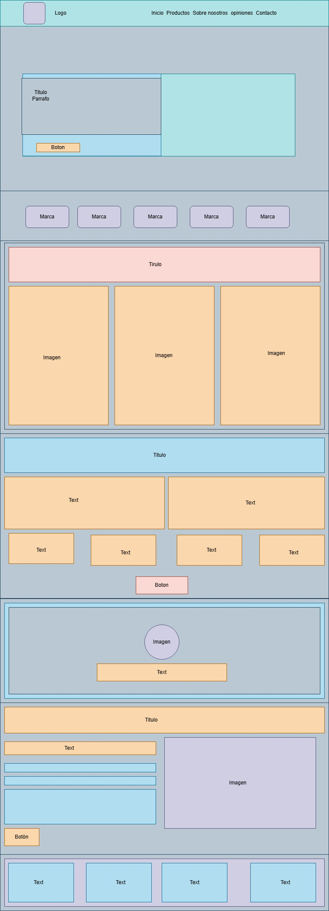

# ☕ Petra Café - Landing Page

Bienvenido al repositorio del proyecto 3 para el bootcamp UDD. **Petra Café**, una landing page desarrollada en HTML, CSS y Bootstrap. Esta página busca transmitir la esencia del café de especialidad, mostrando productos, historia, marcas asociadas, formulario de contacto y testimonios.

## 📸 Vista Previa

El diseño incluye una estructura visual moderna que cuenta con:

- Encabezado con logo y menú de navegación
- Sección de presentación con llamada a la acción
- Marcas asociadas
- Galería de productos con estilo de tarjetas interactivas
- Sección "Sobre Nosotros"
- Formulario de contacto con imagen
- Testimonio destacado
- Footer con enlaces y redes sociales

## 🛠 Tecnologías utilizadas

- HTML5
- CSS3
- Bootstrap 4
- Font Awesome

## ✨ Funcionalidades destacadas

- Scroll suave entre secciones (`scroll-behavior: smooth`)
- Tarjetas animadas con `clip-path` y filtros de brillo
- Responsive: diseño adaptable a móviles y tablets
- Testimonio con imagen circular estilizada
- Formulario funcional con etiquetas HTML5 listas para backend (`procesar_formulario.php`)

## 📁 Estructura de Archivos
```text

/css
└── main.css # Estilos personalizados
└──Boostrap.min.css #Estilos Boostrap

/img
└── ... # Imágenes del sitio (logo, productos, marcas, etc.)

/js
└── bootstrap.min.js
└── jquery-3.5.0.min.js
└── popper.min.js

index.html # Página principal
Diagrama_landing_boostrap.jpg # Diagrama landing boostrap

```
## 👀 Diagrama



Este esquema sirvió como guía para la estructura visual y de contenido.

🚀 Despliegue

Puedes ver la demo activa aquí: [https://petracafe.netlify.app](https://petracafe.netlify.app)